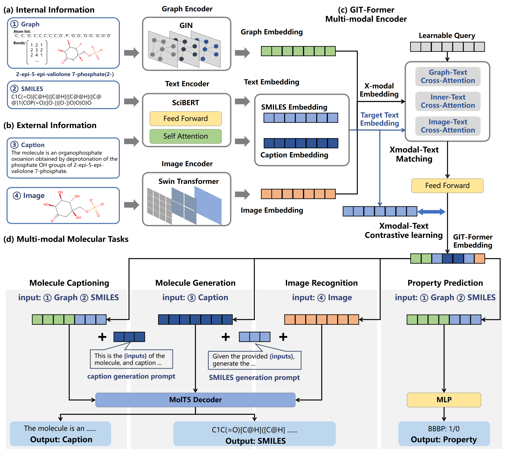

# GIT-Mol
[](https://arxiv.org/abs/2308.06911) 
[](https://doi.org/10.1016/j.compbiomed.2024.108073)

[](https://paperswithcode.com/sota/image-captioning-on-chebi-20?p=git-mol-a-multi-modal-large-language-model)
[](https://paperswithcode.com/sota/text-based-de-novo-molecule-generation-on?p=git-mol-a-multi-modal-large-language-model)

[](https://paperswithcode.com/sota/drug-discovery-on-clintox?p=git-mol-a-multi-modal-large-language-model)
[](https://paperswithcode.com/sota/drug-discovery-on-bbbp?p=git-mol-a-multi-modal-large-language-model)
[](https://paperswithcode.com/sota/drug-discovery-on-sider?p=git-mol-a-multi-modal-large-language-model)
[](https://paperswithcode.com/sota/drug-discovery-on-toxcast?p=git-mol-a-multi-modal-large-language-model)

🎉🎉🎉 Our article was published in Computers in Biology and Medicine, February 2024 🥳

Here, we introduce **GIT-Mol**, a multi-modal large language model that integrates the structure Graph, Image, and Text information, including the Simplified Molecular Input Line Entry System (**SMILES**) and molecule captions. To facilitate the integration of multi-modal molecular data, we propose **GIT-Former**, a novel paradigm capable of mapping all modalities into a unified latent space.

The article has been accepted by *Computers in Biology and Medicine*.



**An overview of GIT-Mol**.
- **(a) Internal Information**: Includes sequence and graph structure representations, emphasizing inherent chemical properties and simple topology.
- **(b) External Information**: For example, images and text descriptions provide richer details and help in human understanding.
- **(c) GIT-Former Multi-modal Encoder**: Architecture and Pre-train Strategy of GIT-Former. GIT-Former aligns graph, image, and text with the target text modality (SMILES strings or captions) using self-attention and cross-attention. The learnable queries interact with each other and the various modalities through these attention layers. Xmodal-Text Matching (XTM) and Xmodal-Text Contrastive Learning (XTC) represent our self-supervised learning strategies tailored for specific modalities (X) and target text modalities.
- **(d) Multi-modal Molecular Tasks**: In cross-modal tasks, GIT-Former generates different embeddings based on various inputs, which MolT5 then decodes into the target text modality and the MLP model for property prediction tasks.


**Note:** The sections on Data, Model, and Training below describe the contents of the respective directories. Due to size constraints and permissions, some data and ckpts may not be uploaded.

## Data

### Pretrain_data
`igdata` - This folder contains the data for pretraining GIT-Former with image, graph, and SMILES modalities.
- train_4m.pkl
- valid_400k.pkl

`igcdata` - This folder contains the data for pretraining GIT-Former with image, graph, and caption modalities.
- train_220k.pkl
- valid_20k.pkl

`image2d` - Data of molecule images in the pretrain stage
- cid.png

### Finetune_data

`ChEBI-20` - This folder contains the data for finetuning GIT-Mol on molecule generation(caption->SMILES)
- train_26k.txt
- validation_3k.txt
- test_3k.txt

`molcap` - This folder contains the data for finetuning GIT-Mol on molecule caption(graph, SMILES->caption) and molecule image caption(image->SMILES)
- train_72k.pkl
- valid_9k.pkl
- test_9k.pkl
- image2d
    - cid.png

`MoleculeNet` - This folder contains the data for finetuning GIT-Mol for molecule properties prediction (classification)
- bbbp
- bace
- tox21
- clintox
- sider
- toxcast

Due to file size constraints, the ChEBI-20 and MoleculeNet datasets can be downloaded from the following links:
- [ChEBI-20_data](https://github.com/blender-nlp/MolT5/tree/main/ChEBI-20_data)
- [MoleculeNet Datasets](https://moleculenet.org/datasets-1)

### Data processing
[data_processing.ipynb](data/data_processing.ipynb)

## Model
`GIT-MOL`
- `ckpts` - This folder contains checkpoints of pretraining and finetuning
    - [SwinTransformer-SwinOCSR](https://github.com/suanfaxiaohuo/SwinOCSR)
    - [GIN-MoMu](https://github.com/ddz16/MoMu)
    - [MolT5-base](https://huggingface.co/laituan245/molt5-base)
    - [MolT5-large](https://huggingface.co/laituan245/molt5-large)
    - [SciBERT](https://huggingface.co/allenai/scibert_scivocab_uncased)
- `configs`
    - config.json - Config file of this model
    - deepspeed_config.json - Config file of deepspeed in Accelerate
- `models`
    - GIT_Former.py - Code of GIT-Former
    - momu.py - Code of the graph encoder
    - momu_gnn.py - Code of the graph encoder
    - swin_transformer.py - Code of the image encoder
    - model_pretrain.py - Code of the pretraining model
    - model_finetune.py - Code of the finetuning model
- `dataset`
    - dataset.py
    - graph_featurizer.py
- `utils`
    - utils.py

## Training
`GIT-MOL`
- `evaluations` - Evaluations of molecule translation tasks
    - fingerprint_metrics.py
    - text_translation_metrics.py
    - mol_translation_metrics.py
- `train`
    - pretrain.py
    - `finetune`
        - molecule_translation.py - Finetuning of the molecule translation task
        - `property_prediction`
            - finetune.py - Finetuning of molecule properties prediction task
            - model.py
            - splitters.py
            - loader.py

**Below are the specific parameter explanations for the `property_prediction` task:**
### property_prediction -- finetune.py 
- `--modals`  
  Modalities used in this task contain graph2d, SMILES, or both.

- `--pool`  
  Type: `str`  
  Default: `avg`  
  Pooling function of text and graph embeddings. Options: Avg or Max.

- `--fusion_mode`  
  Type: `str`  
  Default: `attention`  
  If we use graph2d and SMILES modalities in this task, we can choose the fusion mode of the two embeddings. Options: Attention or Weights.

## References
```
[1]: Xu Z, Li J, Yang Z, et al. SwinOCSR: end-to-end optical chemical structure recognition using a Swin Transformer[J]. Journal of Cheminformatics, 2022, 14(1): 1-13.
[2]: Su B, Du D, Yang Z, et al. A molecular multimodal foundation model associating molecule graphs with natural language[J]. arXiv preprint arXiv:2209.05481, 2022.(https://arxiv.org/abs/2209.05481)
[3]: Edwards C, Lai T, Ros K, et al. Translation between molecules and natural language[J]. arXiv preprint arXiv:2204.11817, 2022.
[4]: Beltagy I, Lo K, Cohan A. SciBERT: A pretrained language model for scientific text[J]. arXiv preprint arXiv:1903.10676, 2019.
[5]: Li J, Li D, Savarese S, et al. Blip-2: Bootstrapping language-image pre-training with frozen image encoders and large language models[J]. arXiv preprint arXiv:2301.12597, 2023.
```
## Citation
```
@article{liu2024git,
  title={Git-mol: A multi-modal large language model for molecular science with graph, image, and text},
  author={Liu, Pengfei and Ren, Yiming and Tao, Jun and Ren, Zhixiang},
  journal={Computers in Biology and Medicine},
  pages={108073},
  year={2024},
  publisher={Elsevier}
}
```
